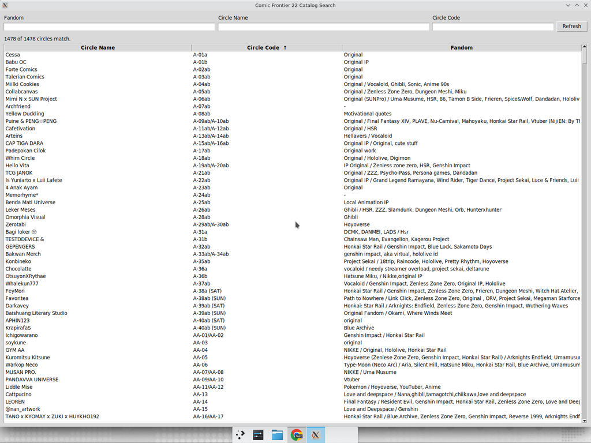
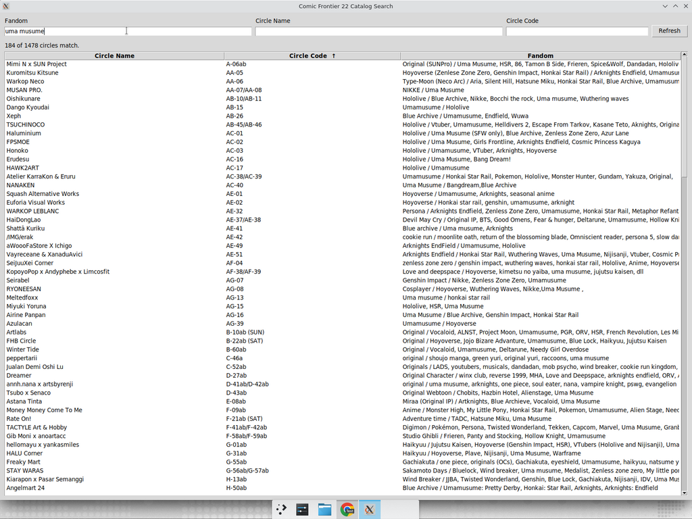
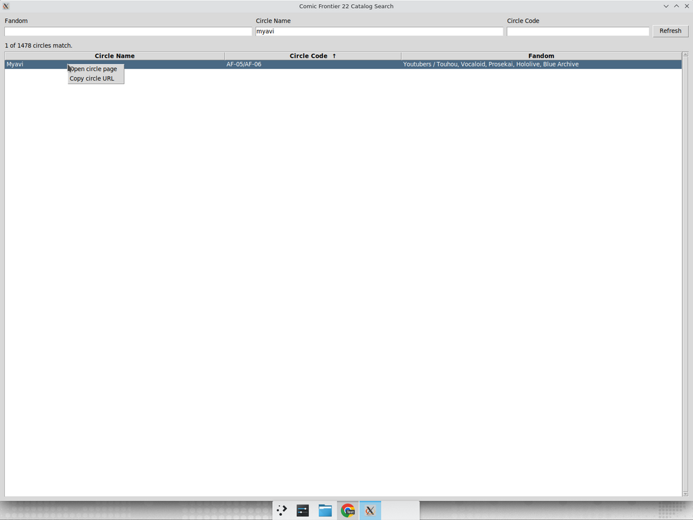
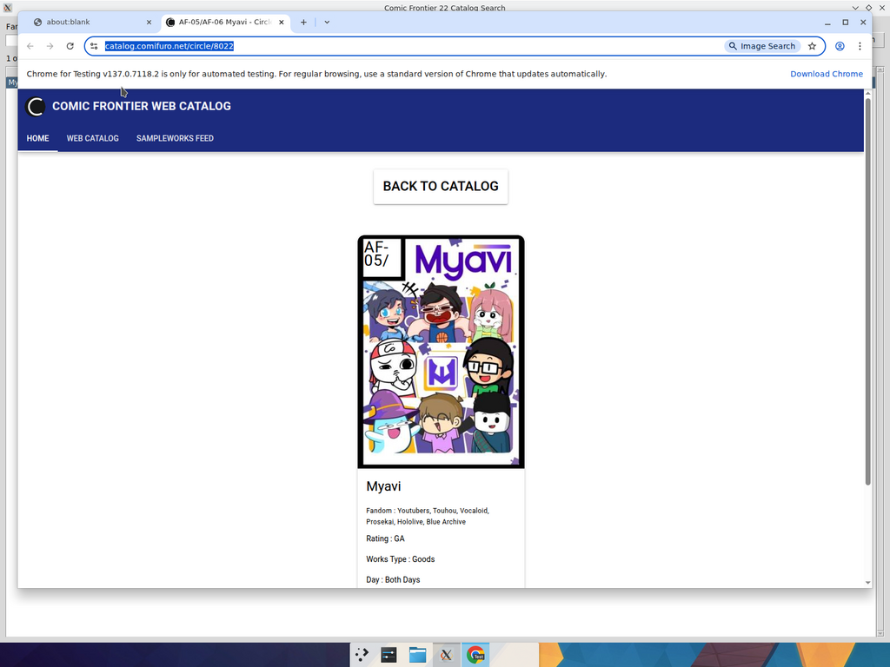
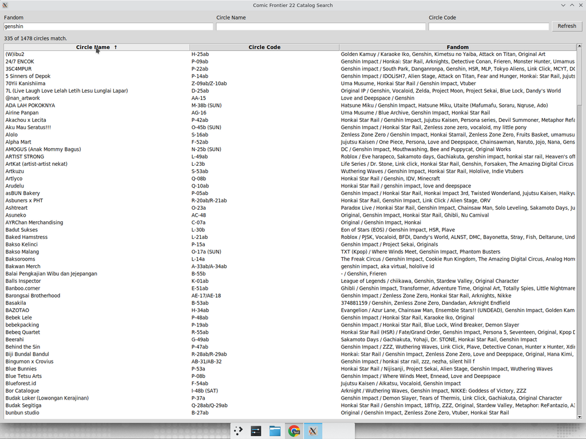

# Comic Frontier 22 Catalog Search

Aplikasi desktop kecil (Python + Tkinter) untuk mencari circle di
[katalog resmi Comic Frontier 22](https://catalog.comifuro.net/catalog) secara
cepat — tanpa perlu scroll ribuan kartu di website-nya.

> Pencarian by **Fandom**, **Circle Name**, dan **Circle Code** sekaligus.
> Tabel hasilnya bisa di-sort per kolom, dan tiap baris bisa di-klik kanan
> untuk langsung membuka halaman circle-nya di browser.



## Fitur

- **Tiga kolom pencarian** (Fandom / Circle Name / Circle Code) yang bekerja
  bersamaan dengan logika **AND** — isi satu, dua, atau ketiganya untuk
  mempersempit hasil.
- **Substring match yang toleran**: input dinormalisasi sebelum dibandingkan,
  yaitu di-lowercase, karakter `@` diubah jadi `a`, dan **seluruh spasi
  dihilangkan**. Jadi `uma musume`, `Uma Musume`, dan `Umamusume` semuanya
  cocok ke entri data yang sama. Begitu juga `idolm@ster` ↔ `idolmaster`.
- **Sortable table**: klik header kolom (Circle Name / Circle Code / Fandom)
  untuk sort ascending, klik lagi untuk descending. Panah (`↑` / `↓`) muncul
  di header yang aktif.
- **Klik kanan pada baris** → menu konteks dengan dua aksi:
  - *Open circle page* — buka `https://catalog.comifuro.net/circle/<id>` di
    browser default.
  - *Copy circle URL* — salin URL ke clipboard.
- **Double-click** sebagai shortcut untuk *Open circle page*.
- **Tombol Refresh** untuk re-fetch katalog dari website kalau ada update.
- **Cache lokal** (`catalog_cache.json`) supaya start-up berikutnya instant.
- **Zero third-party dependencies** — pure Python standard library
  (`tkinter`, `urllib`, `json`, `re`, `webbrowser`).

## Demo

### Pencarian "uma musume" (184 hasil)

Karena spasi diabaikan, hasil mencakup baik entri `Uma Musume` maupun
`Umamusume`:



### Klik kanan untuk buka halaman circle



Pilih *Open circle page* dan halaman circle-nya langsung kebuka di browser:



### Sorting per kolom

Header kolom bisa diklik. Contohnya hasil `genshin` di-sort by *Circle Name*
ascending:



## Cara pakai

### Persyaratan

- Python **3.9+**
- `tkinter` (sudah include di Python untuk Windows/macOS; di Linux
  kemungkinan perlu install package OS-nya):

  ```bash
  # Debian/Ubuntu
  sudo apt-get install python3-tk
  ```

### Jalankan

```bash
git clone https://github.com/<user>/cf22-catalog-search.git
cd cf22-catalog-search
python3 cf22_catalog_search.py
```

Saat pertama dijalankan, aplikasi akan **fetch katalog penuh** dari
`catalog.comifuro.net/catalog` (sekitar 1.5 MB HTML) dan men-cache datanya ke
file `catalog_cache.json` di folder yang sama. Run berikutnya langsung baca
cache, jadi instant.

Tekan tombol **Refresh** di pojok kanan atas untuk fetch ulang.

## Bagaimana cara mendapatkan datanya?

Website CF22 server-side rendering pakai Vue/Nuxt-style: data katalog penuh
sudah tertanam di HTML dalam variabel `window.__INITIAL_STATE__`. Script ini
men-download HTML-nya, lalu mem-parse blok JSON tersebut dengan brace-balanced
parser sederhana — tanpa perlu API key, tanpa headless browser, tanpa
dependency tambahan.

```python
def _extract_initial_state(html: str) -> dict[str, Any]:
    marker = "window.__INITIAL_STATE__="
    idx = html.find(marker)
    ...
    # walk the string, count `{` / `}` (respecting strings & escapes)
    # until the outer object closes, then json.loads(...) the slice.
```

Field yang dipakai per circle:

| field          | dipakai untuk                       |
|----------------|--------------------------------------|
| `id`           | URL halaman circle (`/circle/<id>`) |
| `name`         | kolom Circle Name + filter          |
| `circle_code`  | kolom Circle Code + filter          |
| `fandom`       | kolom Fandom + filter (utama)       |
| `other_fandom` | kolom Fandom + filter (tambahan)    |

## Struktur project

```
cf22_catalog/
├── cf22_catalog_search.py    # script utama (~370 baris, stdlib only)
├── catalog_cache.json        # cache katalog (auto-generated)
├── README.md                 # dokumentasi GitHub
└── docs/
    └── screenshots/          # gambar untuk README & artikel
```

## Disclaimer

Aplikasi ini **tidak berafiliasi** dengan Comic Frontier maupun panitianya.
Datanya 100% dari katalog publik di
[catalog.comifuro.net](https://catalog.comifuro.net/catalog). Project ini
dibuat sebagai pencarian sederhana untuk memudahkan pengunjung event mencari
circle yang ingin dikunjungi.

## Lisensi

MIT — pakai, modifikasi, dan distribusikan dengan bebas.
